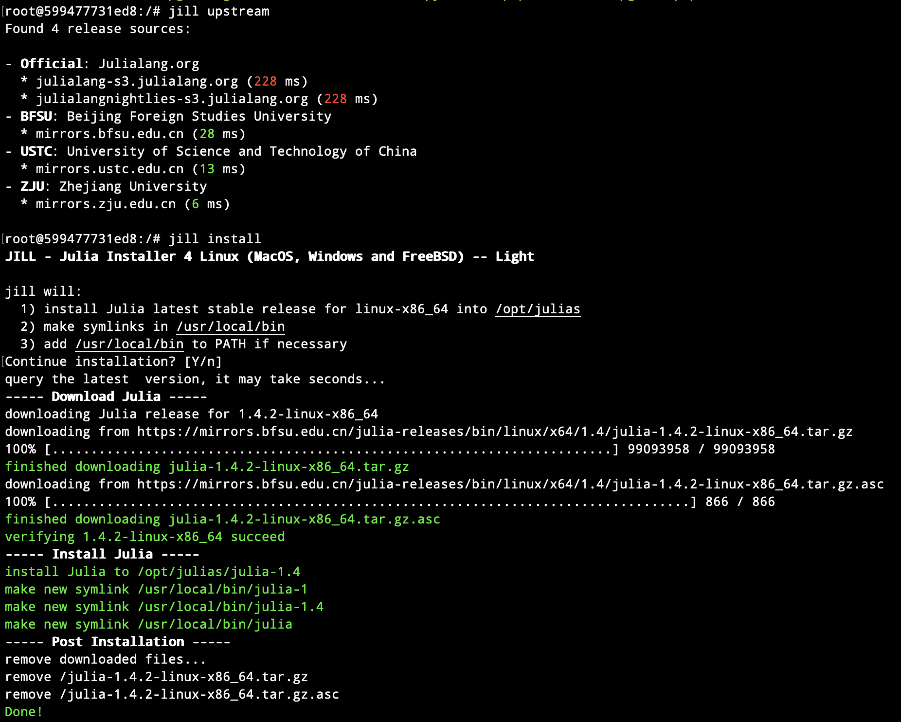

# JILL.py

<p>
  
</p>

_The enhanced Python fork of [JILL](https://github.com/abelsiqueira/jill) -- Julia Installer for Linux (MacOS, Windows and FreeBSD) -- Light_


[](https://pypi.org/project/jill)
[](https://github.com/johnnychen94/jill.py/releases)
[](https://github.com/johnnychen94/jill.py/actions)
[](https://codecov.io/gh/johnnychen94/jill.py)
[](https://github.com/johnnychen94/jill.py/releases)
[](README_zh.md)

Why `jill.py`? Distro package managers (e.g., `apt`, `pac`, `chocho`) is likely to provide a broken Julia with
incorrect binary dependencies (e.g., `LLVM` ) versions. Hence it's recommended to download and
extract the Julia binary provided in [Julia Downloads](https://julialang.org/downloads/). `jill.py` doesn't
do anything magical, but just makes such operation even stupid.

Using Python to install Julia? This is because Python has became one of the main tool for sys admins and it's
available in all platforms; this makes a cross-platform installer for Julia possible.

Is it safe to use this? Yes, `jill.py` use GPG to check every tarballs after downloading. Also, `*.dmg`/`*.pkg` for macOS and
`.exe` for Windows are already singed.

## Features

_let's make a simple and stupid julia installer_

* download Julia release from the *nearest* mirror server.
* immediately knows once there's a new Julia release.
* across multiple platforms.
* manage multiple julia releases.


## Installation

First you'll need to install `jill` using pip: `pip install jill --user -U`

Note that `Python >= 3.6` is required. For base docker images, you also need to make sure `wget` and `gnupg` are installed.

## Usage examples for most users

Basic usage:

`jill install [version] [--confirm] [--upstream UPSTREAM] [--reinstall] [--install_dir INSTALL_DIR] [--symlink_dir SYMLINK_DIR]`

For the first-time users of `jill.py`, you may need to modify `PATH` accordingly so that your shell can find the executables when you type `julia`.

<details>
<summary>installation demo</summary>

</details>

When you type `jill install` (the simplest usage), it does the following things:

1. query latest stable release, it's `1.4.2` at the time of writing.
2. download, verify and install julia `1.4.2`
3. make alias: `julia`, `julia-1`, `julia-1.4`
    * for nightly build, it only bind alias to `julia-latest`

Valid `version` syntax:

- `stable`: latest stable release
- `1`: latest stable `1.y.z` release
- `1.2`: latest stable `1.2.z` release
- `1.2.3`/`1.2.3-rc1`: as it is
- `nightly`/`latest`: nightly builds

Here's a list of slightly advanced usages that you may be interested in:

* download only:
    - latest stable release for current system: `jill download`
    - specific system: `jill download --sys freebsd --arch x86_64`
    - download Julia to specific dir: `jill download --outdir another/dir`
* install Julia for current system:
    - (linux only) system-wide for root: `sudo jill install`
    - upgrade from older julia version: `jill install --upgrade` (copy and paste the root environment folder)
    - don't need interactive promopt: `jill install --confirm`
* upstream:
    - from specific upstream: `jill install --upstream Official`
    - find out all registered upstreams: `jill upstream`
    - add a private upstream: make a modifed copy of [public registry](jill/config/sources.json) at:
        * Linux, MacOS and FreeBSD: `~/.config/jill/sources.json`
        * Windows: `~/AppData/Local/julias/sources.json`

You can find a more verbose documentation using `jill [COMMAND] -h` (e.g., `jill download -h`)

For Julia (>= 1.5.0) in Linux with `musl` dependency, you can

- install it normally, i.e., using `jill install`; `jill` knows that you're using `musl`.
- download it by passing `--sys musl` command. In the meantime, `--sys linux` will give you Julia
  binaries built with `glibc` dependency.

Setting environment variable `JILL_UPSTREAM` will disable the fancy "find-the-nearest-upstream"
feature of `jill` and give you a faster download experience if you just know which upstream is the
fastest. (It has lower priorty than `--upstream` flag.)

## Example with cron

If you're tired of seeing `(xx days old master)` in your nightly build version, then `jill` can
make your nightly build always the latest version using `cron`:

```bash
# /etc/cron.d/jill
PATH=/usr/local/bin:/usr/sbin:/usr/sbin:/usr/bin:/sbin:/bin

# install a fresh nightly build every day
* 0 * * * root jill install latest --confirm
```

Similarly, you can also add a cron job for `jill install --confirm` so that you always get a
latest stable release for `julia`.  `jill` knows the existence of a new version of Julia once
it's released -- you don't even need to upgrade `jill`.

## For who are interested in setting up a new release mirror

Please check out [register new mirror](register_mirror.md).
